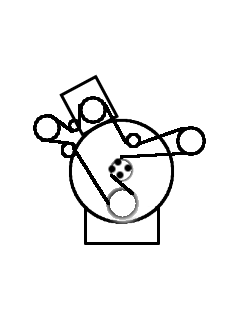
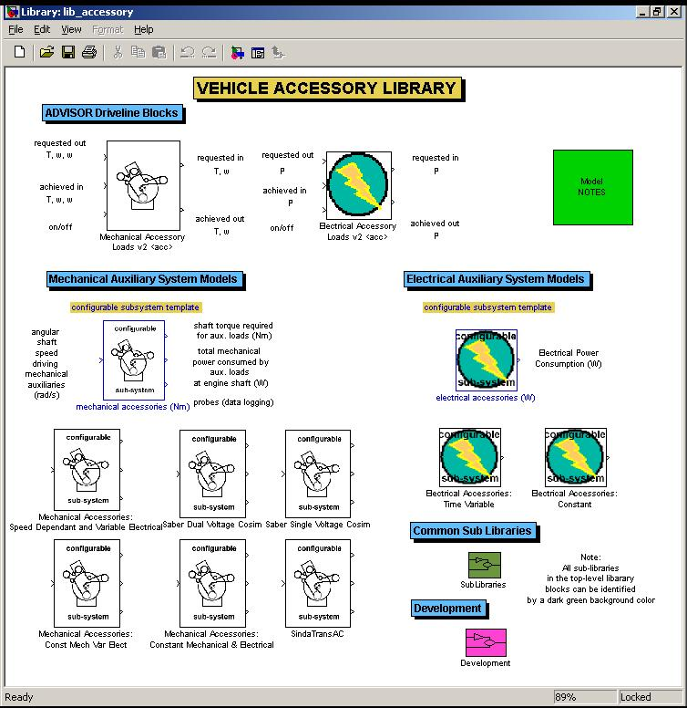

% Accessory Load Models (ADVISOR ver 2002)
% 
% 

Dedicated Auxiliary Load Models using Configurable Subsystems
=============================================================

Implementation
--------------

Advanced users of ADVISOR will notice two new blocks in the ADVISOR
vehicle powertrain block diagrams: Mechanical and Electrical Accessory
Loads. These blocks represent dedicated auxiliary load systems. The
difference between the two blocks is the source of energy. The
mechanical accessory blocks obtain their energy from a spinning shaft.
Electrical loads require an electrical source (e.g., power bus) to power
their loads.

  -------------------------------------- ---------------------------------------
     

  Mechanical Accessory Loads \           Electrical Accessory Loads \
  (powered by mechanical shaft)          (powered by electrical source)
  -------------------------------------- ---------------------------------------

Each block contains a forward model and a backward model. In the
backward model, the auxiliary blocks modify torque or power requests
going up-stream to include that extra torque or power required to
satisfy the accessory loads. In the forward model, torque or power is
subtracted from power generated up-stream and sent to auxiliary loads.
The remaining power flows downstream to the powertrain.

These powertrain blocks are contained in a dedicated accessory loads
library: lib\_accessory (see \<ADVISOR main
directory\>\\models\\library). The lib\_accessory library makes
extensive use of configurable sub-systems. Configurable sub-systems
allow new models to be switched into a simulink model “on the fly”. One
such model allows the simulation of speed-dependant mechanical accessory
loads.

To the casual user, these changes are transparent. The configurable
subsystems are switched using an m-file function called
adjust\_config\_bds.m (located in \<ADVISOR main directory\>\\gui). The
adjust\_config\_bds.m file is called by the GUI after the user sets up
the vehicle definition. The adjust\_config\_bds.m file switches in the
appropriate configurable subsystem model based upon [version and
type](version_type_help.html), and\\or variables sent to the workspace.

### <a name="config_subsystemHOWTO">Adding your own configurable subsystems</a>

It is now possible to add your own user models as configurable
subsystems in the library. The process is relatively straightforward for
users versed in Simulink. As an example, let us make a new auxiliary
load file in the accessory library (in lib\_accessory.mdl). Start by
unlocking the library (edit\>unlock library). Next, copy and past an
existing configurable sub-system block. Break the links between the new
block you are working on and the old block (right click and link
options\>disable link then link options\> break link). Enter the block
and keep the inputs and outputs the same but change the “guts” of the
model to implement your new system. Now, click on the configurable
subsystem template in the library. Place a check box next to the new
model you have just made. Viola! You now have a configurable subsystem
model.

Next, edit adjust\_config\_bds.m to add the new configurable subsystem
choice to the appropriate portion of the switch-case menu. You may need
to create your own custom m-file that will load in the appropriate
initialization information for your new model. You can create a flag
variable to use for adjust\_config\_bds if you do not wish to create a
new version/type.

 

* * * * *

[Return to ADVISOR Documentation](advisor_doc.html)

* * * * *

Last revised: [30-April-2002] mpo \
Created: [17-March-2002] mpo

