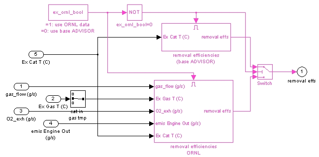
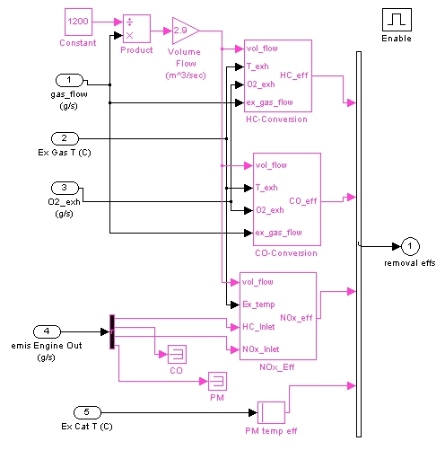

% What's New in ADVISOR
% 
% 

Emissions Control Models
========================

Contributed by Oak Ridge National Laboratory

Emissions control has steadily risen in level of importance both from a
regulatory standpoint and from a consumer perspective.  As the result of
a collaborative effort between NREL and ORNL, two new emissions control
models have been developed.  The two models are for a diesel oxydation
catalyst with and without an integrated diesel particulate filter. 
Previous emissions models determined the tailpipe out emissions based on
constituent conversion efficiencies.  The conversion efficiency for each
constituent was defined as a function of catalyst temperature.  The
catalyst temperature was determined based on the physical properties of
the exhaust system, the exhaust flow rate, and the exhaust temperature. 
The new models add several new dimensions to the conversion efficiency
calculation.  The efficiencies are now a function of catalyst
temperature, exhaust temperature, space velocity (i.e. combination of
catalyst geometry and exhaust flow rate), oxygen concentration, and
critieria emissions concetrations.  Based on test data collected at
ORNL, regression coefficients have been derived to the data with respect
to these input parameters to provide the conversion efficiency values. 
Currently, the diesel oxydation catalyst model is only available for use
with the FC\_CI67\_emis and the FC\_CI60\_emis engine data files.  In
future versions of ADVISOR we expect to include emission models for an
NOx adsorber.

Figure 1 below shows how the model has been integrated into ADVISOR
using a boolean switch, if ex\_ornl\_bool is set to 1 the emission
control models developed at ORNL will be used.  If set to 0 the standard
ADVISOR relationships will be active.  Figure 2 summarizes the inputs
and outputs included in the calculation of the specific constituent
removal efficiencies.  Within each of the \*Conversion blocks there is a
functional relatioship defined correlating the removal efficiency to the
set of input parameters.  The format of the functional relationship and
the coefficients of the relationship have been derived based on
experimental data.  It is recommended that you do not modify the
relationships or the coefficients at this time.

Figure 1: Selection of Emissions Control Models

Figure 2: Calculation of Emissions Removal Efficiencies in ORNL
oxydation catalyst model

We expect that there will be significant development in this section of
the model in future versions of ADVISOR so please do forward any
comments or recommendations you might have to advisor@nrel.gov.

* * * * *

[Return to ADVISOR Documentation](advisor_doc.htm)

* * * * *

Last revised:  [08/20/01] tm \
Created: [08/20/01] tm

