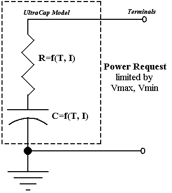
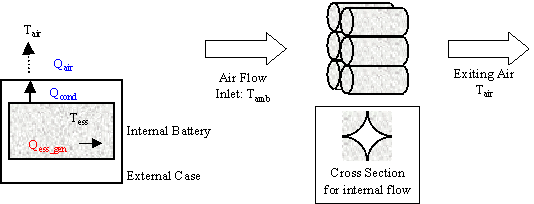
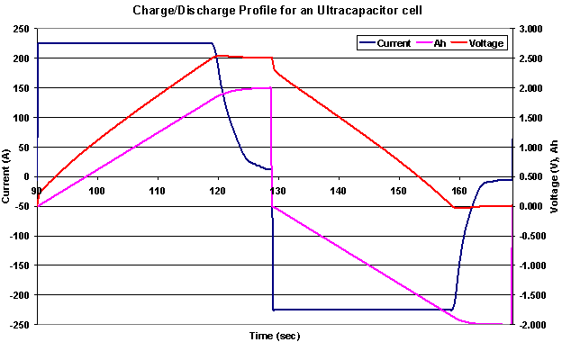
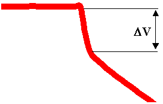

% RC Model
% 
% 

### UltraCap **Model**

**<u>Role of subsystem in vehicle</u>** \
The Energy Storage System (ESS) block typically represents the battery
pack that stores energy on board the modeled vehicle, but in this case
the block represents the ultracapacitor pack that replaces the
traditional battery pack.  This block accepts a power request and
returns available/actual power output from the ultracapacitor pack, the
ultracapacitor pack voltage and current, and the ultracapacitor State of
Charge (SOC).  By convention, positive power is discharge.

**<u>Description of modeling approach</u>** \
ADVISOR’s UltraCap model is shown in circuit form in Figure 1. The
UltraCap model uses power as an input and limits the ultracapacitor
operation to the high and low voltage limits.  Power delivered by the
ultracapacitor is limited to the maximum that the equivalent circuit can
deliver or the maximum that the motor controller can accept, given its
minimum voltage requirement.  However, since the lower voltage limit for
an ultracapacitor is 0V, discharge limiting can also be accomplished by
the powertrain control system based on the “cs\_lo\_soc” value.  A
simple single-node thermal model of the ultracapacitor is implemented
with parallel flow air cooling.  More detail can be found in the
[battery/ultracapacitor thermal model explanation](ess_therm.htm).

The capacitor C is very large and is the means through which the
ultracapacitor stores charge.

**Figure 1: ADVISOR UltraCap Model**

  **<u>Variables used in subsystem</u>**

> [See Appendix A.2: Input
> Variables](advisor_appendices.htm#Input%20Energy%20Storage%20System%20UC)

**<u>Implementation</u>** \
The UltraCap model is implemented in Matlab/Simulink blocks.  The model
limits power to keep the ultracapacitor within operating limits, and
calculates SOC and heat generation from the ultracapacitor. The block
diagram implementation of the model is shown in Figure 2.  A
step-by-step explanation follows.

**\
 Figure 2: Block Diagram implementation of UltraCap model**

1.  The ultracapacitor <u> voltage is determined</u> from the present
    SOC by the relationship shown in Equation 1.\
     \
                                           **Equation
    1\
     \
    **
2.  The set of parameters–Voc, R, and actual Power–are the variables of
    a quadratic equation to solve for the equivalent circuit’s
    <u>current</u>.  The total <u>current that the battery can
    deliver</u> is limited to be in an allowable range.
3.  The ultracapacitor current is then used to update the effective
    <u>SOC</u> of the ultracapacitor .
4.  The thermal model of the ultracapacitor calculates the module
    temperature, which is fed back to be used in determining the
    performance parameters.

Lastly, in using the UltraCap Model, a new functionality is added which
allows the user to add parallel strings of ultracapacitors.  This is
accomplished by changing the variable ‘ess\_parallel\_mod\_num’ to the
integer value of strings that would be placed in parallel.  This enables
the construction of a higher capacity (Ah) ultracapacitor pack.  The
total number of ultracapacitors in use is then calculated by
ess\_module\_num\*ess\_parallel\_mod\_num.

**<u>Parameter Generation</u>** \
Parameter values were determined from analyzing laboratory data
according to the U.S. DOE Electric Vehicle Capacitor Test Procedure
Manual Revision 0.  Parameters were generated for various temperatures
and charge/discharge current values.  The specific test used for
determining capacitance and resistance is a constant current
charge-discharge cycle that is repeated 3 consecutive times with the
voltage held at Vmax and Vmin for 10 seconds in between
charges/discharges.  The current, voltage and Ah values from one
charge-discharge cycle in a representative test can be seen in Figure 3.

**\
 Figure 3: Current, Voltage and Ah data used to determine
ultacapacitor’s C and R values**

<u> Capacitor, C</u> \
The capacitor value in the DOE manual is determined by using Equation 2,
Vw is the “working voltage” or the maximum voltage.  However, this
equation only takes into account the charge added to the ultracapacitor
during the constant current portion of the charge.  Therefore, the
resulting capacitance that is calculated using this value has a Peukert
type of relation that noticeably varies with current rate.  For the
UltraCap model the desired capacitance is the total capacitance so that
the model can determine when the current output should be reduced due to
reaching a voltage limit.

**Equation 2**

Instead of using Equation 2 in the UltraCap model, Equation 3 is used to
determine the total charge into and out of the ultracapacitor (including
the tapered current that tops off the charge to Vmax or levels off the
discharge to 0V) by using the total Amp-Second integration (total
Coulomb charge/discharge) over the test.

**Equation 3**

<u>Resistance, R</u> \
 Resistance values are determined during the same test at the beginning
of a charge or discharge.  Figure 4 shows the delta V that would be used
in Equation 4 to determine the discharge resistance for the specified
current used during this test.  The difficulty with this procedure is
determining at what point the “immediate” drop in voltage ends and the
sloped voltage drop begins.  However, validation tests have resulted in
percent voltage error typically less than 5%.

\
 **Figure 4: Drop in voltage immediately after the beginning of
discharge**

**Equation 4**

* * * * *

[Back to Chapter 3](advisor_ch3.htm)

Last Revised: 4/29/02: mdz
