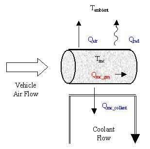
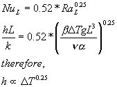
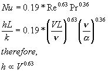

% Motor Controller
% 
% 

### Motor/controller

*[Motor/controller block diagram](mc.gif)*

**<u>Role of subsystem in vehicle</u>** \
The ‘motor/controller’ block translates torque and speed requests into
electric power requests and converts actual power input to torque and
speed output.

**<u>Description of modeling approach</u>** \
The motor/controller model includes the effects of losses in the motor
and controller, rotor inertia, and the motor’s torque speed-dependent
torque capability. Power losses are handled as a 2-D lookup table
indexed by rotor speed and output torque. The motor’s maximum torque is
enforced using a lookup table indexed by rotor speed. [Motor
control](mc_cont.htm) blocks outside the ‘motor/controller’ ensure that
the controller’s maximum current is not exceeded and that the motor
shuts down when it is not needed. Available torque is computed from
available power by assuming that the ratio of rotor torque to input
(electric) power is the same for the actual/achievable situation as was
computed for the request. This is mathematically equivalent to assuming
the motor/controller efficiency. Rotor speed for the actual/achievable
calculations is as computed in the ‘request’ branch.

**<u>Variables used in subsystem</u>**

> [See Appendix A.2: Input
> Variables](advisor_appendices.htm#Input%20Motor/Controller) \
> [See Appendix A.3: Output
> Variables](advisor_appendices.htm#Output%20Motor/Controller)

**<u>Implementation: Thermal Model</u>** \
A simple thermal model of the motor calculates the temperature of the
motor and the thermal power rejected in to the coolant to maintain this
temperature.  The motor is modeled as a lumped capacity mass with liquid
cooling based on a thermostat setpoint.  Heat is generated by the motor,
and removed through natural and forced convection, radiation to ambient
air, and forced liquid cooling (see Figure 1).

 \
**Figure 1: Schematic of motor thermal model**

<u>Qmc\_gen</u> \
The heat generated by the motor is found from the input power and output
torque and speed.  *Q~mc\_gen~=P~in~-T\*w*.

<u>Qair</u> \
Heat is removed from the motor through natural and forced convection
with the ambient air.  *Q~air~=h~air~\*A\*(T~mc~-T~ambient~)*   The heat
transfer coefficient is computed using known heat transfer coefficients
for given experimental conditions.  For a DT
of 1000^o^C, h from natural convection was 6 W/m^2^K.  For air flow of
30 mph, h from forced convection was 60 W/m^2^K.  A minimum of h~air~
was set to a natural convection level at 6 W/m^2^K.  For natural
convection over an arbitrary shape, the Nusselt number is related to the
Rayleigh number by the following equation^\*^:

For forced convection over a cylinder, the Nusselt number is related to
the Rayleigh number by the following equation^\*^:

Thus the equation for the heat transfer coefficient used in the model
was: *h~air~*=6+6\*( DT/1000)^0.25^+60\*(
V~air~/30)^0.63^.  Air speed over the motor is assumed to be half of the
vehicle speed.

<u>Qrad</u> \
Heat was also removed through radiation. 
*Q~rad~=es\*A\*(T~mc~^4^-T~ambient~^4^)=0.9\*5.67E-8\*A\*(T~mc~^4^-T~ambient~^4^)*The
emissivity was assumed to be 0.9, and here the temperatures are in
Kelvin.

<u>Qmc\_coolant</u> \
The coolant flow was turned on if the temperature of the motor exceeded
a thermostat setpoint.  The details of the flow are not considered.  It
is assumed that all of the extra energy (=Qmc\_gen-Qair-Qrad) is
absorbed into the coolant.

<u>Tmc</u> \
Finally, the temperature of the motor was found by integrating the added
heat through time, adjusting for the heat capacity of the
motor. 

Figure 2 shows the block diagram implementation.

 \
**Figure 2: Block diagram of motor thermal model**

\*Reference: Basic Heat and Mass Transfer, Anthony F. Mills, Irwin,
1995. \

* * * * *

[Back to Chapter 3](advisor_ch3.htm)

Last Revised: 7/21/00:AB
