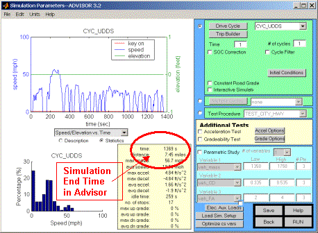
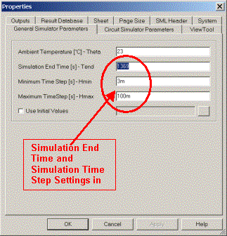
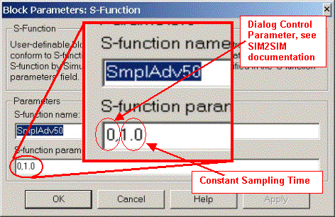
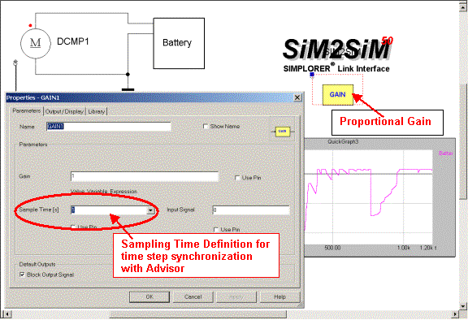

% SIMPLORER®–ADVISOR Link Interface Version 1
% 
% 

SIMPLORER^®^–ADVISOR Link Interface Version 1.0<o:p></o:p>
-----------------------------------------------------------------------------------------------------------------------

<!--[if !supportEmptyParas]--> <!--[endif]--><o:p></o:p>

**Preface<o:p></o:p>**

<!--[if !supportEmptyParas]--> <!--[endif]--><o:p></o:p>

Ansoft developed the SIMPLORER–ADVISOR link to provide an easy-to-use,
fast, and powerful electrical-system simulation capability for ADVISOR’s
sophisticated system-level vehicle simulations. With the increasing
electrical content of cars for communications, telematics, convenience
features, added safety equipment, and new technologies such as X-by
wire, the electrical subsystem of the car significantly influences
overall vehicle behavior, emissions, and fuel economy. These
developments and increased interest in alternative propulsion concepts
(electric or hybrid-electric vehicles), the new 42V system voltage, and
battery management require designers to combine electrical and
system-level vehicle simulations.

<!--[if !supportEmptyParas]--> <!--[endif]--><o:p></o:p>

This document is intended to give users who want to try the
SIMPLORER–ADVISOR link guidance for a successful setup of a coupled
problem and to run it. A complete reference manual is under development
and will be available with version 2.0 of the link. The current link is
already fully functional and extremely flexible. It allows engineers to
combine SIMPLORER’s easy-to-use modeling capabilities with ADVISOR’s
powerful system-level simulation capabilities.

<!--[if !supportEmptyParas]--> <!--[endif]--><o:p></o:p>

This link runs only with a licensed SIMPLORER version. If you already
have SIMPLORER, the only thing you need is the license for the SIMPLORER
- Simulink^®^(SIM2SIM) interface. If you do not have a SIMPLORER
license, you can request an evaluation copy. Please check Ansoft’s Web
site to find your local sales representative or follow this link:

<!--[if !supportEmptyParas]--> <!--[endif]--><o:p></o:p>

<http://www.ansoft.com/products/em/simplorer/advisor>

<!--[if !supportEmptyParas]--> <!--[endif]--><o:p></o:p>

**System Requirements<o:p></o:p>**

<!--[if !supportEmptyParas]--> <!--[endif]--><o:p></o:p>

To use the SIMPLORER–ADVISOR link, you need the following:

<!--[if !supportEmptyParas]--> <!--[endif]--><o:p></o:p>

1.  Operating System

<!--[if !supportEmptyParas]--> <!--[endif]--><o:p></o:p>

ADVISOR is a Matlab^®^/Simulink^®^ application. Although Matlab/Simulink
is available for Windows^®^ and UNIX^®^ operating systems, ADVISOR is
developed and tested on Windows platforms only. SIMPLORER runs on
Windows platforms only.

<!--[if !supportEmptyParas]--> <!--[endif]--><o:p></o:p>

2.  SIMPLORER

<!--[if !supportEmptyParas]--> <!--[endif]--><o:p></o:p>

SIMPLORER requires Windows 2000 or Windows NT.

<!--[if !supportEmptyParas]--> <!--[endif]--><o:p></o:p>

3.  Hardware Requirements

<!--[if !supportEmptyParas]--> <!--[endif]--><o:p></o:p>

The values listed first are required for reliable SIMPLORER performance.
Values in parentheses are recommended for optimal performance.

<!--[if !supportEmptyParas]--> <!--[endif]--><o:p></o:p>

CPU: Pentium^®^ 400 MHz (1.4 GHz)

Memory: 128 MB (256 MB)

Hard disk: 150 MB (2 GB,SCSI or ATA 100)

Operating system: Windows 2000/Windows NT 4.0

Network version: Windows NT Server

Graphics card: VGA 800x600 (1024 x 768)

<!--[if !supportEmptyParas]--> <!--[endif]--><o:p></o:p>

**Installation<o:p></o:p>**

<!--[if !supportEmptyParas]--> <!--[endif]--><o:p></o:p>

The SIMPLORER–ADVISOR link requires an installed and licensed version of
SIMPLORER 5.0 with licensed SIM2SIM link.

<!--[if !supportEmptyParas]--> <!--[endif]--><o:p></o:p>

To install SIMPLORER, please insert your SIMPLORER CD-ROM and follow the
instructions on the screen. Please make sure that the SIM2SIM link is
enabled with your license. If you are not sure, please contact your
local sales office (see our Web site at
[www.ansoft.com](http://www.ansoft.com/)).

<!--[if !supportEmptyParas]--> <!--[endif]--><o:p></o:p>

<!--[if !supportEmptyParas]--> <!--[endif]--><o:p></o:p>

Running The Advisor/Simplorer Demo
==================================

<!--[if !supportEmptyParas]--> <!--[endif]--><o:p></o:p>

The ADVISOR/Simplorer demo can be run following these steps:

<!--[if !supportEmptyParas]--> <!--[endif]--><o:p></o:p>

1.  Remove all spaces in the ADVISOR path
    (example:  change
    “c:\\Advisor 2002\\” to “c:\\Advisor\_2002\\”).
2.  Open ADVISOR and hit **Start**. 
    This brings up the “Vehicle Input” figure.
3.  On the “Vehicle Input” figure, choose “SimplorerDemo\_in” from the
    “Load File” menu.
4.  Click **View Block Diagram**. 
    This opens an ADVISOR block diagram that contains the link to
    Simplorer.
5.  Double click on the SmplAdv50 S-Function
    block.  A “Block Parameters:
    S-Function” dialog appears.
6.  Change the “S-function parameters” to “1,1.0” and hit
    **OK**.  
7.  Browse and select the file:
    “…ADVISOR\\models\\Simplorer\\dc\_generator\_with\_battery\_model.sml.” 
    Click **OK** on the “Link Assignment Dialog.”
8.  Double click again on the SmplAdv50 S-Function
    block.  Change the “S-function parameters” to “0,1.0” and
    hit **OK**.
9.  Go back to the “Vehicle Input” screen and select **Continue**.
10. Make the “Drive Cycle” selection “CYC\_UDDS” if it is not
    already.  Hit
    **Run**.  
11. A Simplorer screen appears. 
    Hit **OK**.  The
    simulation should run.  After
    the simulation, the ADVISOR results screen will
    appear.  To see the results
    sent from Simplorer to ADVISOR, click on an axis, select “Other”
    from the “Component” menu and select “Voltage” from the “Plot
    Variable” menu.

 

**Modeling<o:p></o:p>**

<!--[if !supportEmptyParas]--> <!--[endif]--><o:p></o:p>

To create a model with a link between SIMPLORER and ADVISOR, perform
these steps:

<!--[if !supportEmptyParas]--> <!--[endif]--><o:p></o:p>

1.  Create your SIMPLORER model using the SIMPLORER schematic and make
    sure it runs as expected.
2.  Use one of the predefined vehicle setups or create your own in
    ADVISOR and make sure it runs as expected.
3.  Once the models run, in both of the models, link elements have to be
    inserted and the connection between the quantities of each simulator
    has to be made.

<!--[if !supportEmptyParas]--> <!--[endif]--><o:p></o:p>

The following section describes the major features and procedures. Some
limitations and restrictions apply. They will be resolved in later
versions of the SIMPLORER–ADVISOR link:

<!--[if !supportEmptyParas]--> <!--[endif]--><o:p></o:p>

1.  Please refer to the SIMPLORER manual to learn how the link generally
    operates. The ADVISOR link is a modified version of SIMPLORER’s
    SIM2SIM interface, the co-simulation interface between SIMPLORER and
    Simulink.
2.  The min. and max. simulation step sizes for the electrical system
    and the other components of the SIMPLORER model must be defined in
    the SIMPLORER model prior to the simulation.
3.  In both simulation packages, the same simulation end time must be
    used. Since the simulation end time is defined by the ADVISOR drive
    cycles, it is recommended using this data as simulation end-time
    setting in SIMPLORER. You will find the settings in the Simulation
    Parameters dialog of ADVISOR.

<!--[if !supportEmptyParas]--> <!--[endif]--><o:p></o:p>

<!--[if gte vml 1]><v:group
 id="_x0000_s1026" style='position:absolute;margin-left:0;margin-top:0;width:343.8pt;
 height:252pt;z-index:1;mso-position-horizontal-relative:char;
 mso-position-vertical-relative:line' coordsize="6876,5040">
 <o:lock v:ext="edit" rotation="t" aspectratio="t" position="t"/>
 <v:shapetype id="_x0000_t75" coordsize="21600,21600" o:spt="75"
  o:preferrelative="t" path="m@4@5l@4@11@9@11@9@5xe" filled="f" stroked="f">
  <v:stroke joinstyle="miter"/>
  <v:formulas>
   <v:f eqn="if lineDrawn pixelLineWidth 0"/>
   <v:f eqn="sum @0 1 0"/>
   <v:f eqn="sum 0 0 @1"/>
   <v:f eqn="prod @2 1 2"/>
   <v:f eqn="prod @3 21600 pixelWidth"/>
   <v:f eqn="prod @3 21600 pixelHeight"/>
   <v:f eqn="sum @0 0 1"/>
   <v:f eqn="prod @6 1 2"/>
   <v:f eqn="prod @7 21600 pixelWidth"/>
   <v:f eqn="sum @8 21600 0"/>
   <v:f eqn="prod @7 21600 pixelHeight"/>
   <v:f eqn="sum @10 21600 0"/>
  </v:formulas>
  <v:path o:extrusionok="f" gradientshapeok="t" o:connecttype="rect"/>
  <o:lock v:ext="edit" aspectratio="t"/>
 </v:shapetype><v:shape id="_x0000_s1027" type="#_x0000_t75" style='position:absolute;
  width:6876;height:5040' o:preferrelative="f">
  <v:fill o:detectmouseclick="t"/>
  <v:path o:extrusionok="t" o:connecttype="none"/>
 </v:shape><v:shape id="_x0000_s1028" type="#_x0000_t75" style='position:absolute;
  width:6876;height:5040'>
  <v:imagedata src="./Simplorer_cosim_help2_files/image001.png" o:title=""/>
 </v:shape><v:oval id="_x0000_s1029" style='position:absolute;left:2814;top:2856;
  width:1284;height:780' filled="f" strokecolor="red" strokeweight="2.25pt"/>
 <v:shapetype id="_x0000_t202" coordsize="21600,21600" o:spt="202" path="m0,0l0,21600,21600,21600,21600,0xe">
  <v:stroke joinstyle="miter"/>
  <v:path gradientshapeok="t" o:connecttype="rect"/>
 </v:shapetype><v:shape id="_x0000_s1030" type="#_x0000_t202" style='position:absolute;
  left:1218;top:3504;width:1416;height:816' filled="f" strokecolor="red">
  <v:textbox style='mso-next-textbox:#_x0000_s1030'>
   <![if !mso]>
   <table cellpadding=0 cellspacing=0 width="100%">
    <tr>
     <td><![endif]>
     

     
<b style='mso-bidi-font-weight:normal'>Simulation End Time
     in Advisor<o:p></o:p></b>

     

     <![if !mso]></td>
    </tr>
   </table>
   <![endif]></v:textbox>
 </v:shape><v:line id="_x0000_s1031" style='position:absolute;flip:y' from="2418,3348"
  to="3246,3912" strokecolor="red">
  <v:stroke endarrow="block"/>
 </v:line><w:anchorlock/>
</v:group><![endif]--><!--[if !vml]--><!--[endif]--><!--[if gte vml 1]><v:shape
 id="_x0000_i1025" type="#_x0000_t75" style='width:343.5pt;height:252pt'>
 <v:imagedata croptop="-65520f" cropbottom="65520f"/>
 <o:lock v:ext="edit" rotation="t" position="t"/>
</v:shape><![endif]--><!--[if !vml]--><!--[endif]-->

<!--[if !supportEmptyParas]--> <!--[endif]--><o:p></o:p>

<!--[if gte vml 1]><v:group
 id="_x0000_s1032" style='position:absolute;margin-left:0;margin-top:0;width:241.9pt;
 height:252pt;z-index:2;mso-position-horizontal-relative:char;
 mso-position-vertical-relative:line' coordsize="4838,5040">
 <o:lock v:ext="edit" rotation="t" aspectratio="t" position="t"/>
 <v:shape id="_x0000_s1033" type="#_x0000_t75" style='position:absolute;
  width:4838;height:5040' o:preferrelative="f">
  <v:fill o:detectmouseclick="t"/>
  <v:path o:extrusionok="t" o:connecttype="none"/>
 </v:shape><v:shape id="_x0000_s1034" type="#_x0000_t75" style='position:absolute;
  width:4838;height:5040'>
  <v:imagedata src="./Simplorer_cosim_help2_files/image004.png" o:title=""/>
 </v:shape><v:oval id="_x0000_s1035" style='position:absolute;left:2154;top:1188;
  width:1056;height:1200' filled="f" strokecolor="red" strokeweight="2.25pt"/>
 <v:shape id="_x0000_s1036" type="#_x0000_t202" style='position:absolute;
  left:500;top:2964;width:1956;height:1080' filled="f" strokecolor="red">
  <v:textbox style='mso-next-textbox:#_x0000_s1036'>
   <![if !mso]>
   <table cellpadding=0 cellspacing=0 width="100%">
    <tr>
     <td><![endif]>
     

     
<b style='mso-bidi-font-weight:normal'>Simulation End Time
     and Simulation Time Step Settings in SIMPLORER<o:p></o:p></b>

     

     <![if !mso]></td>
    </tr>
   </table>
   <![endif]></v:textbox>
 </v:shape><v:line id="_x0000_s1037" style='position:absolute;flip:y' from="1506,1908"
  to="2454,3096" strokecolor="red" strokeweight="2.25pt">
  <v:stroke endarrow="block"/>
 </v:line><w:anchorlock/>
</v:group><![endif]--><!--[if !vml]--><!--[endif]--><!--[if gte vml 1]><v:shape
 id="_x0000_i1026" type="#_x0000_t75" style='width:241.5pt;height:252pt'>
 <v:imagedata croptop="-65520f" cropbottom="65520f"/>
 <o:lock v:ext="edit" rotation="t" position="t"/>
</v:shape><![endif]--><!--[if !vml]--><!--[endif]-->

<!--[if !supportEmptyParas]--> <!--[endif]--><o:p></o:p>

4.  ADVISOR operates with constant simulation time step. This time-step
    value has to be transferred to SIMPLORER. For that purpose, the
    constant sampling time has to be defined as second parameter in the
    Block Parameters dialog for the SIMPLORER–ADVISOR link S-function.

<!--[if !supportEmptyParas]--> <!--[endif]--><o:p></o:p>

<!--[if gte vml 1]><v:group
 id="_x0000_s1038" style='position:absolute;margin-left:0;margin-top:0;width:354pt;
 height:229.8pt;z-index:3;mso-position-horizontal-relative:char;
 mso-position-vertical-relative:line' coordsize="7080,4596">
 <o:lock v:ext="edit" rotation="t" aspectratio="t" position="t"/>
 <v:shape id="_x0000_s1039" type="#_x0000_t75" style='position:absolute;
  width:7080;height:4596' o:preferrelative="f">
  <v:fill o:detectmouseclick="t"/>
  <v:path o:extrusionok="t" o:connecttype="none"/>
 </v:shape><v:shape id="_x0000_s1040" type="#_x0000_t75" style='position:absolute;
  width:7075;height:4596'>
  <v:imagedata src="./Simplorer_cosim_help2_files/image007.png" o:title=""/>
 </v:shape><v:rect id="_x0000_s1041" style='position:absolute;left:1764;top:480;
  width:3144;height:2928' filled="f" strokecolor="red" strokeweight="3pt"/>
 <v:oval id="_x0000_s1042" style='position:absolute;left:192;top:3288;width:708;
  height:456' filled="f" strokecolor="red" strokeweight="1.5pt"/>
 <v:line id="_x0000_s1043" style='position:absolute;flip:y' from="264,480"
  to="1764,3348" strokecolor="red" strokeweight="2.25pt"/>
 <v:line id="_x0000_s1044" style='position:absolute;flip:y' from="660,3408"
  to="4872,3744" strokecolor="red" strokeweight="2.25pt"/>
 <v:oval id="_x0000_s1045" style='position:absolute;left:2544;top:2496;width:528;
  height:684' filled="f" strokecolor="red" strokeweight="1pt"/>
 <v:oval id="_x0000_s1046" style='position:absolute;left:2004;top:2496;width:528;
  height:684' filled="f" strokecolor="red" strokeweight="1pt"/>
 <v:shape id="_x0000_s1047" type="#_x0000_t202" style='position:absolute;
  left:4056;top:3612;width:2760;height:468' strokecolor="red">
  <v:textbox style='mso-next-textbox:#_x0000_s1047'>
   <![if !mso]>
   <table cellpadding=0 cellspacing=0 width="100%">
    <tr>
     <td><![endif]>
     

     
<b style='mso-bidi-font-weight:normal'>Constant Sampling
     Time<o:p></o:p></b>

     

     <![if !mso]></td>
    </tr>
   </table>
   <![endif]></v:textbox>
 </v:shape><v:shape id="_x0000_s1048" type="#_x0000_t202" style='position:absolute;
  left:5076;top:324;width:1812;height:1080' strokecolor="red">
  <v:textbox style='mso-next-textbox:#_x0000_s1048'>
   <![if !mso]>
   <table cellpadding=0 cellspacing=0 width="100%">
    <tr>
     <td><![endif]>
     

     
<b style='mso-bidi-font-weight:normal'>Dialog Control
     Parameter, see SIM2SIM documentation<o:p></o:p></b>

     

     <![if !mso]></td>
    </tr>
   </table>
   <![endif]></v:textbox>
 </v:shape><v:line id="_x0000_s1049" style='position:absolute;flip:x' from="2400,852"
  to="5196,2532" strokecolor="red" strokeweight="1.5pt">
  <v:stroke endarrow="block"/>
 </v:line><v:line id="_x0000_s1050" style='position:absolute;flip:x y' from="3096,3024"
  to="4740,3708" strokecolor="red" strokeweight="1.5pt">
  <v:stroke endarrow="block"/>
 </v:line><w:anchorlock/>
</v:group><![endif]--><!--[if !vml]--><!--[endif]--><!--[if gte vml 1]><v:shape
 id="_x0000_i1027" type="#_x0000_t75" style='width:354pt;height:229.5pt'>
 <v:imagedata croptop="-65520f" cropbottom="65520f"/>
 <o:lock v:ext="edit" rotation="t" position="t"/>
</v:shape><![endif]--><!--[if !vml]--><!--[endif]-->

<!--[if !supportEmptyParas]--> <!--[endif]--><o:p></o:p>

5.  To make sure that SIMPLORER works with that constant sampling time
    in addition to the variable step-size settings for the electrical
    network, a proportional gain block has to be placed at the SIMPLORER
    schematic. Please define the constant time step of ADVISOR as
    sampling time in the block wizard (open with double-click on the
    block symbol).

<!--[if !supportEmptyParas]--> <!--[endif]--><o:p></o:p>

<!--[if gte vml 1]><v:group
 id="_x0000_s1051" style='position:absolute;margin-left:0;margin-top:0;width:432.15pt;
 height:295.2pt;z-index:4;mso-position-horizontal-relative:char;
 mso-position-vertical-relative:line' coordsize="8643,5904">
 <o:lock v:ext="edit" rotation="t" aspectratio="t" position="t"/>
 <v:shape id="_x0000_s1052" type="#_x0000_t75" style='position:absolute;
  width:8643;height:5904' o:preferrelative="f">
  <v:fill o:detectmouseclick="t"/>
  <v:path o:extrusionok="t" o:connecttype="none"/>
 </v:shape><v:shape id="_x0000_s1053" type="#_x0000_t75" style='position:absolute;
  width:8643;height:5901'>
  <v:imagedata src="./Simplorer_cosim_help2_files/image010.png" o:title=""/>
 </v:shape><v:shape id="_x0000_s1054" type="#_x0000_t202" style='position:absolute;
  left:6120;top:2028;width:2052;height:456'>
  <v:textbox style='mso-next-textbox:#_x0000_s1054'>
   <![if !mso]>
   <table cellpadding=0 cellspacing=0 width="100%">
    <tr>
     <td><![endif]>
     

     
<b style='mso-bidi-font-weight:normal'>Proportional Gain<o:p></o:p></b>

     

     <![if !mso]></td>
    </tr>
   </table>
   <![endif]></v:textbox>
 </v:shape><v:oval id="_x0000_s1055" style='position:absolute;left:276;top:3564;
  width:2628;height:672' filled="f" strokecolor="red" strokeweight="2.25pt"/>
 <v:shape id="_x0000_s1056" type="#_x0000_t202" style='position:absolute;
  left:2088;top:4308;width:3060;height:804' strokecolor="red">
  <v:textbox style='mso-next-textbox:#_x0000_s1056'>
   <![if !mso]>
   <table cellpadding=0 cellspacing=0 width="100%">
    <tr>
     <td><![endif]>
     

     
<b style='mso-bidi-font-weight:normal'>Sampling Time
     Definition for time step synchronization with Advisor<o:p></o:p></b>

     

     <![if !mso]></td>
    </tr>
   </table>
   <![endif]></v:textbox>
 </v:shape><v:line id="_x0000_s1057" style='position:absolute;flip:x y' from="2004,3912"
  to="2448,4404" strokecolor="red" strokeweight="1.5pt">
  <v:stroke endarrow="block"/>
 </v:line><v:line id="_x0000_s1058" style='position:absolute;flip:x y' from="6468,1716"
  to="7080,2160" strokecolor="red" strokeweight="1.5pt">
  <v:stroke endarrow="block"/>
 </v:line><w:anchorlock/>
</v:group><![endif]--><!--[if !vml]--><!--[endif]--><!--[if gte vml 1]><v:shape
 id="_x0000_i1028" type="#_x0000_t75" style='width:6in;height:295.5pt'>
 <v:imagedata croptop="-65520f" cropbottom="65520f"/>
 <o:lock v:ext="edit" rotation="t" position="t"/>
</v:shape><![endif]--><!--[if !vml]--><!--[endif]-->

<!--[if !supportEmptyParas]--> <!--[endif]--><o:p></o:p>

Using the Gain block, SIMPLORER synchronizes its simulation time steps
to the ADVISOR simulation time steps. The SmplAdv50.dll automatically
exchanges the defined quantities between the two simulators at each
ADVISOR time step. Between these constant time steps, SIMPLORER inserts
additional variable time steps as required for an accurate computation
of the circuit.

<!--[if !supportEmptyParas]--> <!--[endif]--><o:p></o:p>

6.  The simulation is initiated by clicking the RUN button in ADVISOR.
    The link DLL automatically invokes SIMPLORER. All defined outputs
    are displayed in the SIMPLORER View Tool or, if previously simulated
    without ADVISOR, also in the schematic using active display
    elements.

<!--[if !supportEmptyParas]--> <!--[endif]--><o:p></o:p>

**Limitations<o:p></o:p>**

**<!--[if !supportEmptyParas]--> <!--[endif]--><o:p></o:p>**

Currently, there is only one SIMPLORER–ADVISOR link element per
simulation allowed. It also is not possible to run the SIM2SIM interface
simultaneously with the SIMPLORER–ADVISOR interface. All link
information between the simulators is stored in a directory C:\\winnt.
It is necessary that users have access to that directory. The settings
are not project-specific. Each time you define a new project, the former
settings are overwritten.

<!--[if !supportEmptyParas]--> <!--[endif]--><o:p></o:p>

<ins cite="mailto:abrooker" datetime="2002-04-29T11:34">

* * * * *

</ins>

[<ins cite="mailto:abrooker" datetime="2002-04-29T11:34">Back
to What’s
New</ins>](whats_new.html)<ins cite="mailto:abrooker" datetime="2002-04-29T11:34">\

</ins>[<ins cite="mailto:abrooker" datetime="2002-04-29T11:34">ADVISOR
Documentation
Contents</ins>](advisor_doc.htm)<ins cite="mailto:abrooker" datetime="2002-04-29T11:34"><o:p></o:p></ins>

<ins cite="mailto:abrooker" datetime="2002-04-29T11:34">Last
Revised: [29-April-2002]: ab <o:p></o:p></ins>

<ins cite="mailto:abrooker" datetime="2002-04-29T11:34"><!--[if !supportEmptyParas]--> <!--[endif]--><o:p></o:p></ins>

<!--[if !supportEmptyParas]--> <!--[endif]--><o:p></o:p>

<!--[if !supportEmptyParas]--> <!--[endif]--><o:p></o:p>

