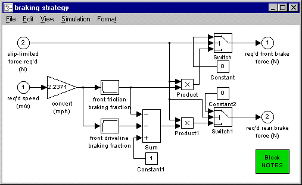

% Brake control: required
% 
% 

### Brake control: required

**<u>Role of subsystem in vehicle</u>** \
The ‘braking strategy’ block determines how much braking force is
required of the front brakes and the rear brakes.  The balance of the
required tractive force will be made up by the drivetrain to the best of
its ability.  (If the driveline is limited in its braking ability, the
front and rear brakes will make up this final deficit according to their
ability.  See the documentation of the [achievable brake
controller](brake_cont_ach.htm) for more info.)

**<u>Description of modeling approach</u>** \
The required braking force is a function of vehicle speed and total
braking force required.  A 1-D lookup table is used to determine the
fraction of braking force provided by the front and rear brakes.

**<u>Equations used in subsystem</u>**

1.  (friction braking force required of front brakes) = (total braking
    force required) \* (fraction of total braking force provided by
    front friction brakes)
2.  (friction braking force required of rear brakes) = (total braking
    force required) \* [1-(fraction of total braking force required of
    front friction brakes) - (fraction of total braking force required
    of driveline)]
3.  (fraction of total braking force required of front friction brakes)
    = f(vehicle speed)
4.  (fraction of total braking force required of driveline) = f(vehicle
    speed)

All braking forces are negative by convention.

**<u>Variables used in subsystem</u>** \
wh\_fa\_fric\_brake\_frac    wh\_fa\_dl\_brake\_frac \
wh\_fa\_fric\_brake\_mph   wh\_fa\_dl\_brake\_mph

> [See Appendix A.2: Input
> Variables](advisor_appendices.htm#Input%20Wheel/Axle)

* * * * *

[Back to Chapter 3](advisor_ch3.htm)

